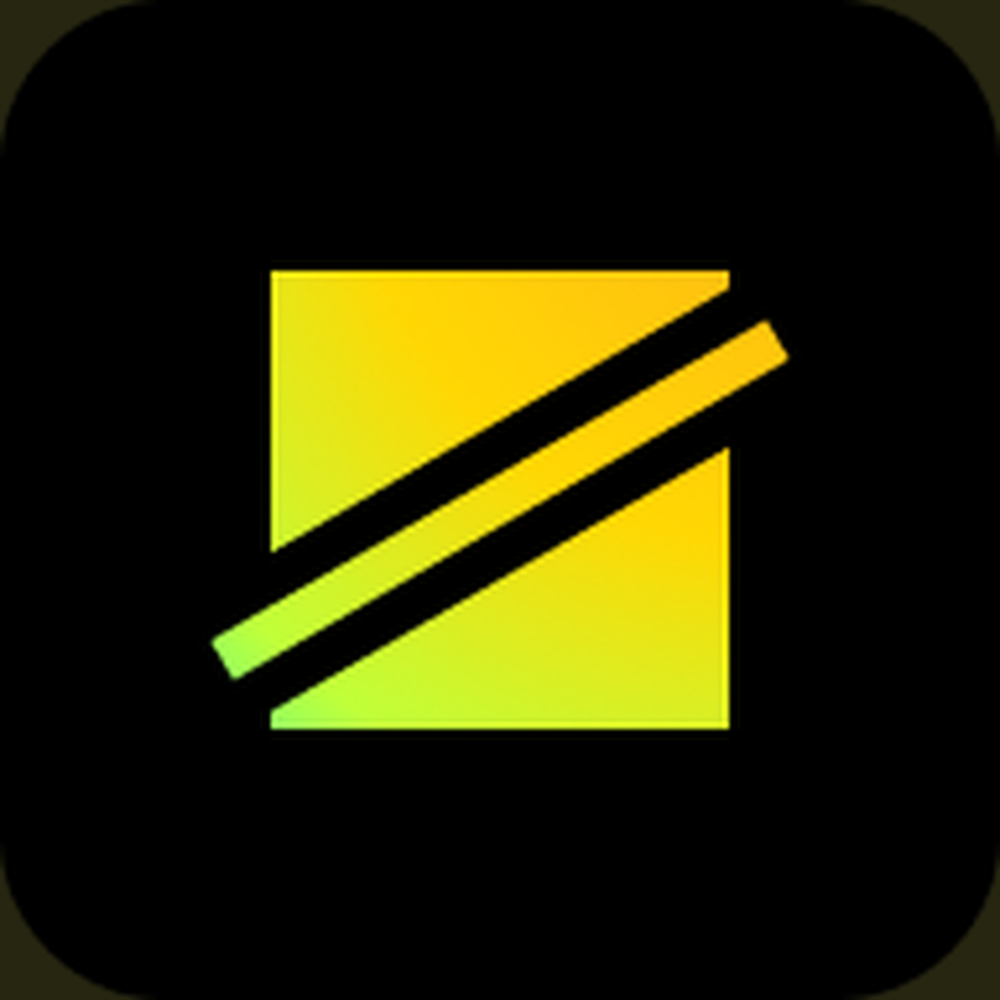
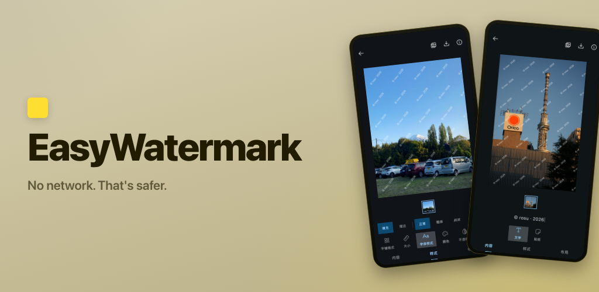
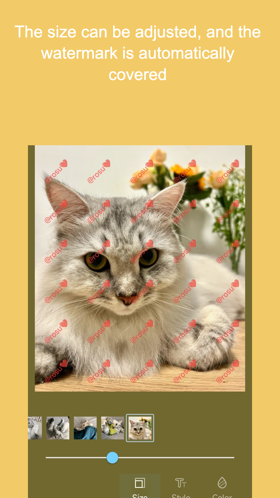
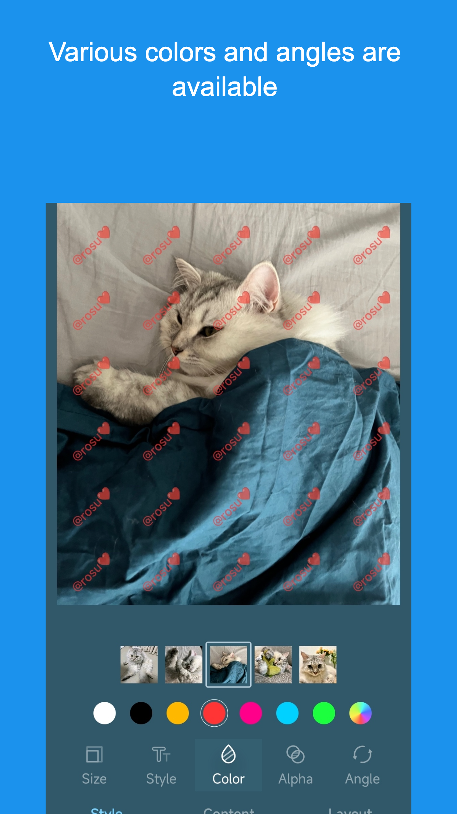
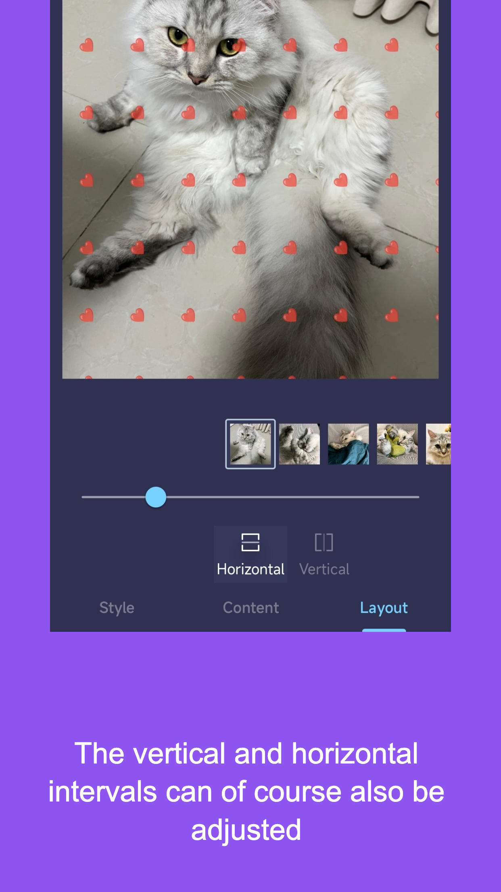
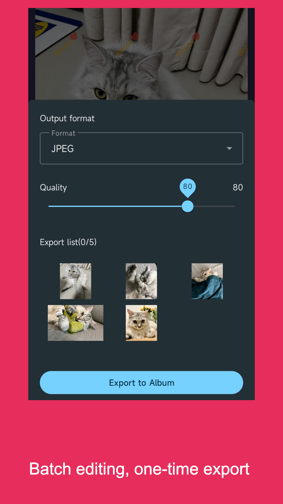
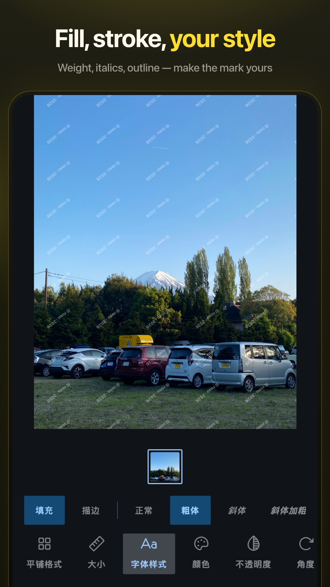
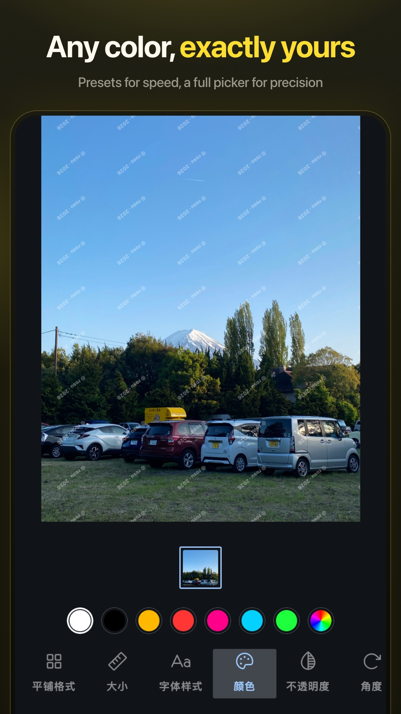
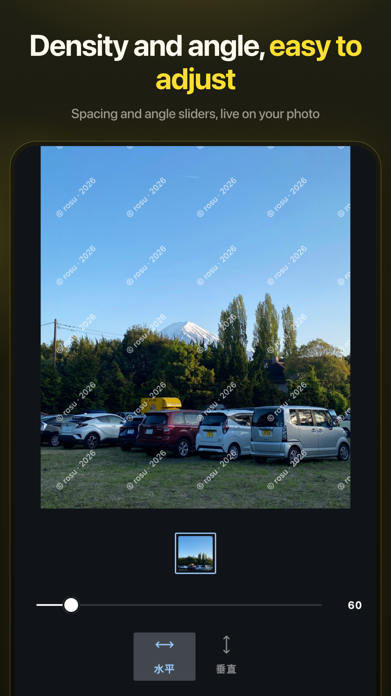
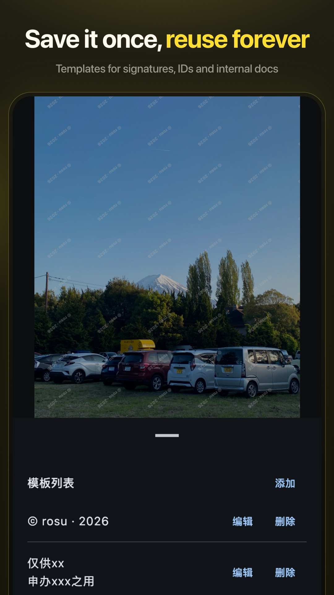

  

<h1 align="center">Easy Watermark</h1>

  <strong>No network. That's safer.</strong>

  <a href="./README.md">English</a> · <a href="./README_zh-CN.md">简体中文</a>

  
  &nbsp;
  
  &nbsp;
  

  Securely, easily watermark sensitive photos. 
  For ID uploads, proofs, and images that should not be reused.

  

  
  
  

  
  
  
  

  
  
  
  

## Features

- **Text and image marks** — a signature, a logo, or a short purpose line.
- **Style** — color, fill or stroke, typeface, size, opacity, and angle. Live on the photo.
- **Layout** — horizontal and vertical spacing, plus tile or single placement.
- **Templates** — save a line once and reuse it on the next batch.
- **Batch** — pick several photos, keep the same mark, export them together.
- **Clean export** — JPEG or PNG. All EXIF, including location, is stripped.

## Usage

For ID photos, proofs, and other images you have to send. A line such as *This photo is for XX, for XXX only* is enough. Keep opacity low so the important part stays readable.

## Privacy

Easy Watermark does not collect analytics, device IDs, or crash reports. There is no third-party tracking SDK.

On Android 10 and later, choosing a photo is the only permission the app needs. Android 9 and below still require storage access to read and save images.

See the [Privacy Policy](PrivacyPolicy.md).

## Get the app

Use a developer-run channel:

| Channel | Notes |
|---|---|
| [GitHub Releases](https://github.com/rosuH/EasyWatermark/releases) | Latest APK |
| [Google Play](https://play.google.com/store/apps/details?id=me.rosuh.easywatermark) | Paid edition, same code — supports ongoing development |
| [F-Droid](https://f-droid.org/packages/me.rosuh.easywatermark/) | Free, reproducible build |
| [Coolapk](https://www.coolapk.com/apk/272743) | Listed for users in China |

Listings elsewhere are unofficial. Check the package name `me.rosuh.easywatermark` before you install.

## Open source

The app is [MIT](LICENSE) licensed. Issues and pull requests are welcome. Translations go through [Weblate](https://hosted.weblate.org/engage/easywatermark/).

Bugs that cannot be reported in-app (there is no crash reporter) can be mailed to [hi@rosuh.me](mailto:hi@rosuh.me).

## Credit

**Design**

- Interface by [@tovi](https://www.figma.com/@tovi). The UI and related design assets remain his — please do not reuse them without permission.

**Icons**

- [Phosphor Icons](https://phosphoricons.com/) — selected Regular-weight glyphs, vendored as Compose vectors. License notice in [THIRD_PARTY_NOTICES.md](THIRD_PARTY_NOTICES.md).

**Libraries**

- [Coil](https://github.com/coil-kt/coil) — gallery, filmstrip, and other UI thumbnails
- [Material Components for Android](https://github.com/material-components/material-components-android)
- [ColorPickerView](https://github.com/skydoves/ColorPickerView) — Android custom color dialog
