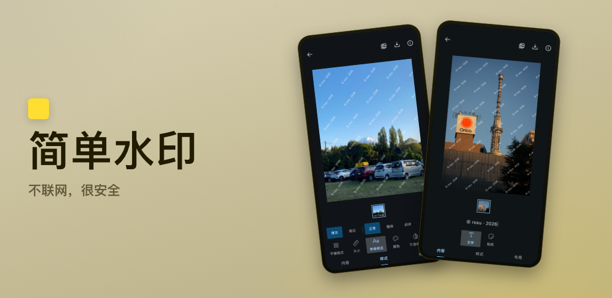
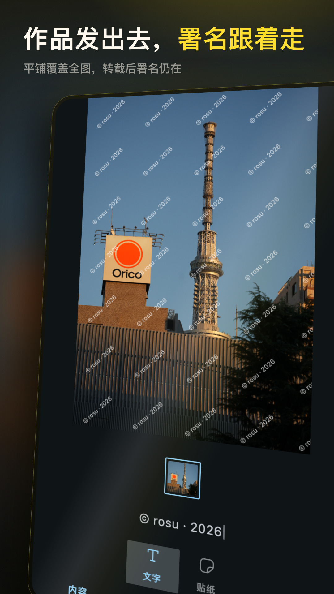
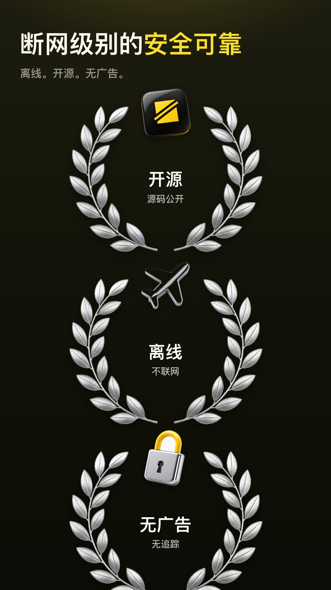
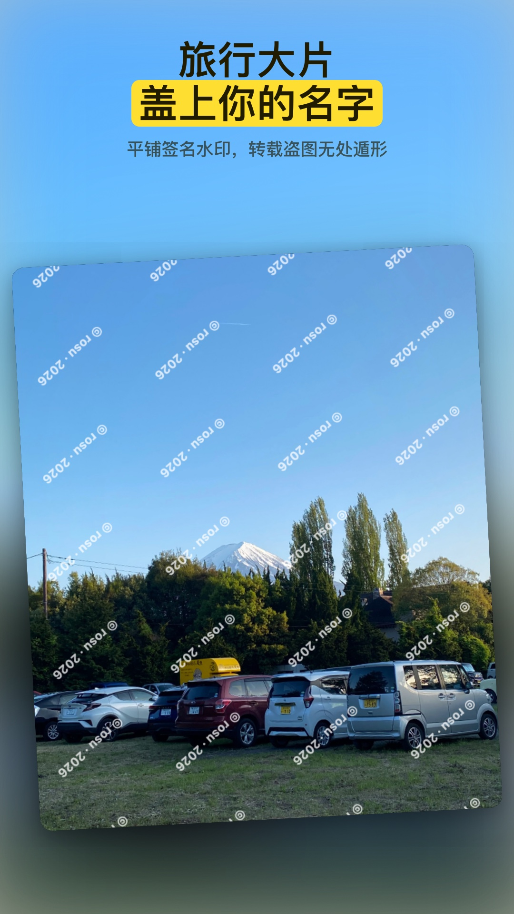
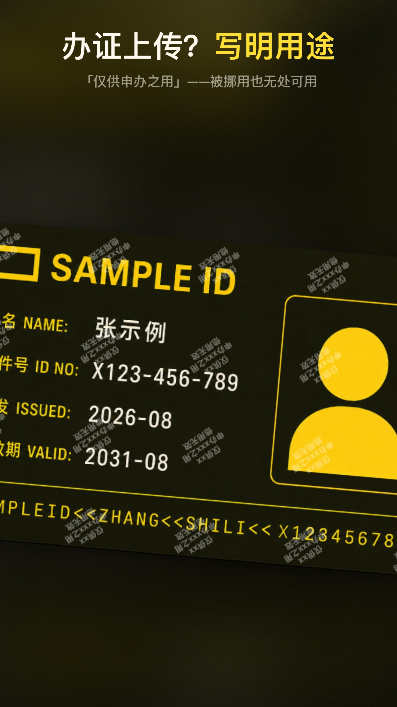
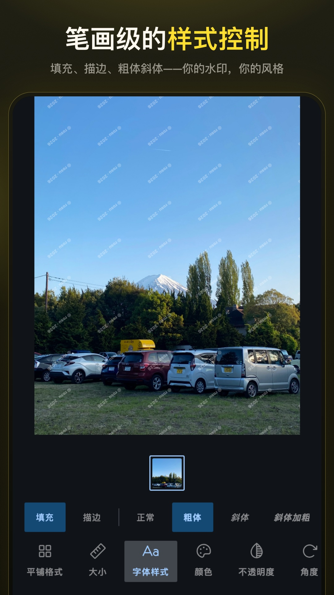
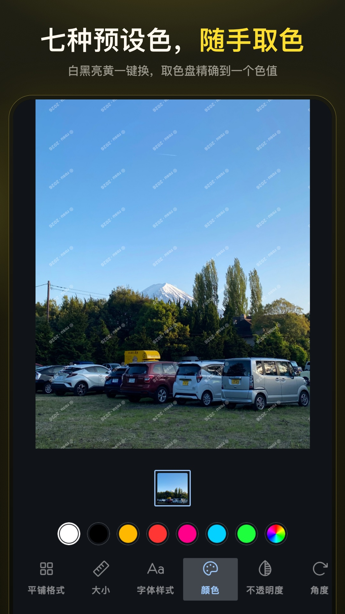
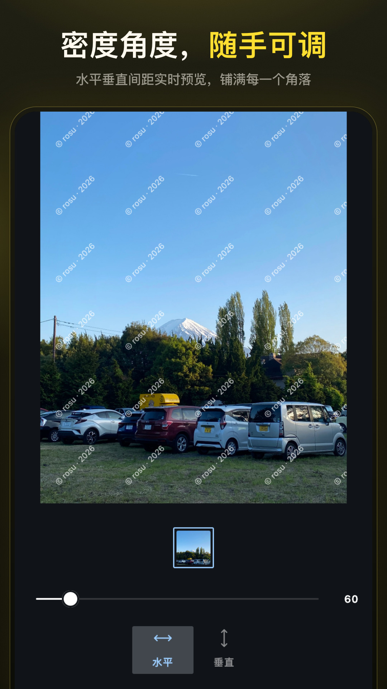
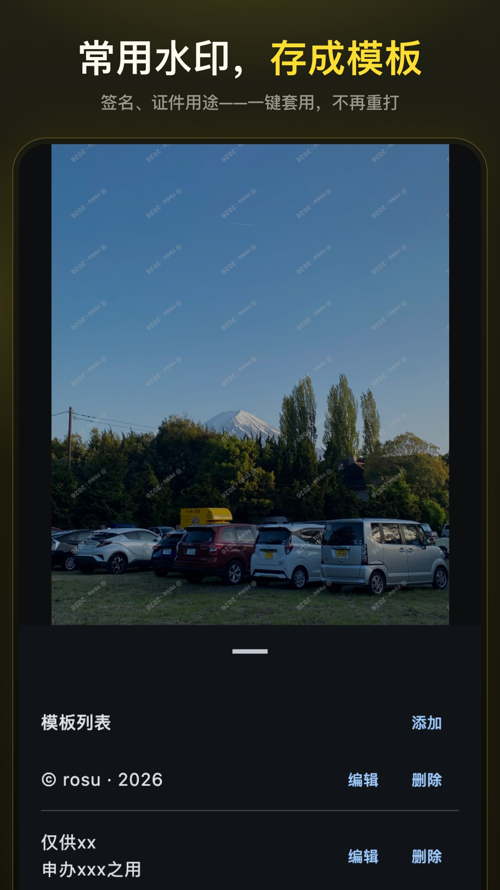

  

<h1 align="center">简单水印</h1>

  <strong>不联网，很安全。</strong>

  <a href="./README.md">English</a> · <a href="./README_zh-CN.md">简体中文</a>

  
  &nbsp;
  
  &nbsp;
  

  安全、简单地为敏感照片加水印。 
  尤其适合必须上传的证件照、手持证件、早期小样和带版权的图片。

  

  
  
  

  
  
  
  

  
  
  
  

## 功能

- **文字与图片水印** — 署名、标志，或一句用途说明。
- **样式** — 颜色、填充或描边、字重、大小、不透明度、角度，都在照片上即时可见。
- **布局** — 横竖间距可调，支持平铺或单枚放置。
- **模板** — 常用文案存一次，下一批直接套用。
- **批量** — 一次选多张，同一套水印，一起导出。
- **干净导出** — JPEG 或 PNG。包括定位信息在内的 EXIF 全部剥离。

## 如何使用

适合需要提交证件照、手持证件或敏感照片的场合。例如实名认证、项目小样、带版权的预览图。

参考文案：*本照片仅供 xx 作 xx 之用，他用无效。* 不透明度调低一些，不要挡住关键信息。

## 隐私

简单水印不采集统计、设备标识，也没有崩溃上报，更没有第三方追踪 SDK。

Android 10 及以上只需选图，不必再要其他运行时权限。Android 9 及以下仍需存储权限，才能读取和保存照片。

详见 [隐私政策](PrivacyPolicy_zh-CN.md)。

## 下载

请使用开发者维护的渠道：

| 渠道 | 说明 |
|---|---|
| [GitHub Releases](https://github.com/rosuH/EasyWatermark/releases) | 最新 APK |
| [Google Play](https://play.google.com/store/apps/details?id=me.rosuh.easywatermark) | 付费版，代码一致，用于支持后续开发 |
| [F-Droid](https://f-droid.org/packages/me.rosuh.easywatermark/) | 免费，可复现构建 |
| [酷安](https://www.coolapk.com/apk/272743) | 国内列表 |

其他渠道均非开发者维护。安装前请核对包名 `me.rosuh.easywatermark`。

## 开源

本应用使用 [MIT](LICENSE) 协议。欢迎提交 Issue 与 Pull Request。翻译请走 [Weblate](https://hosted.weblate.org/engage/easywatermark/zh_Hans/)。

应用内没有崩溃上报。如需联系，请发邮件至 [hi@rosuh.me](mailto:hi@rosuh.me)。

## 致谢

**设计**

- 界面由 [@tovi](https://www.figma.com/@tovi) 设计。UI 及相关设计资源的权利归他所有，未经许可请勿使用。

**图标**

- [Phosphor Icons](https://phosphoricons.com/) — 选用 Regular 字重，作为 Compose 矢量资源内置。完整声明见 [THIRD_PARTY_NOTICES.md](THIRD_PARTY_NOTICES.md)。

**第三方库**

- [Coil](https://github.com/coil-kt/coil) — 图库、胶片条等界面缩略图
- [Material Components for Android](https://github.com/material-components/material-components-android)
- [ColorPickerView](https://github.com/skydoves/ColorPickerView) — Android 自定义取色对话框
