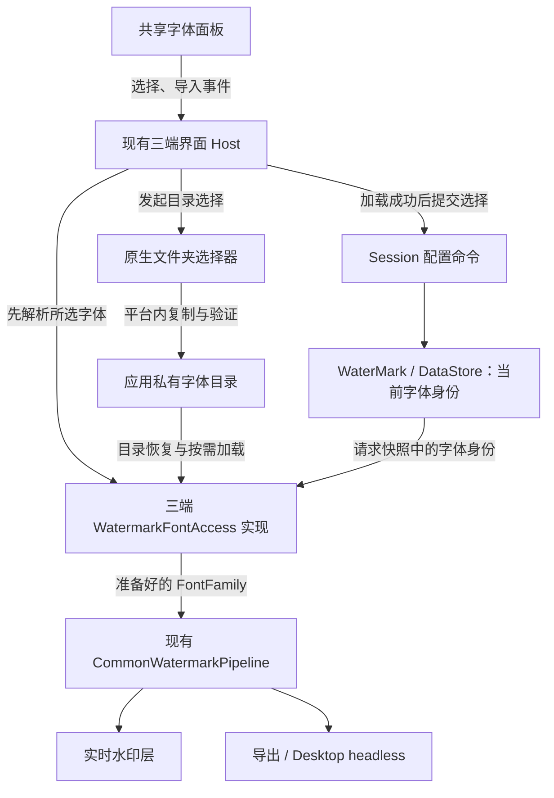

# ADR-0035：三端自定义水印字体

**Status:** Accepted — owner-approved 2026-09-05; implementation on `codex/custom-watermark-fonts` (attempt 9 runtime evidence)

**Amended:** 2026-09-12 — local name search, window-based panel height, and compact IME header are in-scope product requirements. The original UI plan’s “no search” item is superseded.

**Date:** 2026-09-05

**Owner scope:** Android、iOS、Desktop 首版同时支持字体面板、系统字体、文件夹导入和导入列表持久化

**Amends if accepted:** ADR-0025 的“生产只使用系统默认字体”；保留不打包 Noto、不在线下载字体、同设备预览与导出字体来源一致的约束

**Related:** ADR-0017 / ADR-0018（Session 与共享渲染）、ADR-0019（资源）、ADR-0024（模板数据库）、ADR-0026（面板适配）、ADR-0033（实时水印层）

## 1. 设计结论

采用 **共享面板与字体身份模型 + 三端字体适配 + 现有共享渲染管线**。

系统字体不复制进字体库；用户导入字体复制到应用私有目录，用内容哈希标识不可变副本。当前选择保存在现有 `WaterMark` DataStore，列表从字体目录恢复。字体选择沿用 Session 配置命令，不创建第二份实时配置，也不新增共享 ViewModel。

字体加载与原生选择器位于平台层。渲染层继续只接收 `FontFamily?`，不认识字体目录、系统家族名称或文件选择器权限。Android、iOS、Desktop 都是本设计的消费者，不以 Desktop 原型通过代替移动端支持。



图中的 `FontFamily` 由当前预览或导出调用者传入管线；不是字体适配器主动调用渲染。目录导入完成后 Host 刷新列表，不自动改变当前字体。

## 2. 已核实的接入基础

| 当前实现 | 对设计的约束 |
|---|---|
| `CommonWatermarkPipeline.compose`、`composeCell` 已接收可选字体 | 复用参数，不建立另一条文字渲染路径 |
| `WaterMark` 只有 `TextTypeface`，没有字体身份 | 新增字段，保留旧粗体/斜体整数键 |
| 控件经 `WatermarkConfigChange` → Session → `WatermarkConfigEditor` 写配置 | 字体选择走同一路径，面板不直写 DataStore |
| Session `startExport` 在图片循环外读取一次配置 | 把字体身份纳入该快照即可，不为此重写批量导出 |
| Android 手写 `previewFingerprint()` | 必须纳入字体身份，不能只依赖 `WaterMark` 新字段 |
| Desktop 有原生目录选择 helper | 复用其 macOS AWT 目录模式及其他桌面系统分流 |
| iOS / Desktop 的生产字体仍是默认值 | 字体枚举成功不等于渲染已接通，需分别验收 |

入口文件见第 9 节；本次仅检查源码，没有运行构建或设备验证。

## 3. 共享模型与最小接口

以下是拟议的接口形状，不是已编译代码：

```kotlin
sealed interface WatermarkFontRef {
    data object Default : WatermarkFontRef
    data class System(val platform: String, val key: String) : WatermarkFontRef
    data class Imported(val sha256: String) : WatermarkFontRef
    data object Unavailable : WatermarkFontRef // 仅用于读取损坏/未知编码，不可作为选择写入
}

data class FontEntry(
    val ref: WatermarkFontRef,
    val displayName: String,
)

interface WatermarkFontAccess {
    suspend fun listSystemFonts(): List<FontEntry>
    suspend fun listImportedFonts(): List<FontEntry>
    suspend fun resolve(ref: WatermarkFontRef): FontResolution
}
```

`FontResolution` 是成功的 `FontFamily` 与可用样式集合，或可显示的失败原因，不能把加载失败编码成 `null`。仅 `Default` 允许映射到现有默认值。三个平台实现这个接口，现有 Host 持有列表加载与错误状态；不同来源独立加载，一个失败不清空另一个。

`Unavailable` 是读取错误哨兵，不是第四种字体来源。损坏或不认识的持久编码映射到它，保留磁盘原值并向 Host 报错，避免 Flow 解码异常或无声覆盖；用户显式选择有效字体后才重写该 key。它不能作为可选列表项或成功解析结果。

原生目录选择与 `importDirectory(nativeDirectory)` 留在各平台的具体实现，不把 `Uri`、`NSURL`、`File` 或长期目录句柄暴露给共享接口。Host 通过 `onImportFolder` 回调连接选择器与导入函数，再调用 `listImportedFonts()` 刷新。接口不为未来字体下载、同步、收藏、删除提供空方法。

### 身份与显示分离

- `Default`：现有系统默认语义。始终显示在面板中。
- `System`：平台作用域内的不透明稳定 key，绝不是本次枚举顺序。Android 文件集合可能含 collection index / variation；iOS、Desktop 可使用经渲染验证的字体或 face 名称。具体 key 由适配器编码，不能从显示名反推身份。
- `Imported`：整个文件的 SHA-256。首版用户导入范围为可解析的单 face TTF/OTF；同名不同内容保留，相同内容不重复存储。TTC 导入扩展不属于本次默认范围，但系统字体集合中的 face 身份仍必须正确区分。
- 字体行按可选择的字体或 face 显示，不跨文件自动合并“同名家族”。必要时显示 family + style；读取不到名称时使用导入文件的 basename，不展示外部完整路径。

可变 TTF/OTF 采用加载器支持的默认实例，不增加轴调节 UI；无法加载的实例报错，不偷偷替换为另一字体。`TextTypeface` 保留四种样式值，但控件只启用已解析字体实际支持的样式。选择的 face 若本身为粗体，Normal 不会将它变回 regular。

当前 Compose Native 字体合成为 no-op，单个 regular 文件不能承诺伪粗体/伪斜体。首版不自动合并同名文件来猜测 family：用户可直接选择导入的 Bold/Italic face。切换字体时，若原 `TextTypeface` 不受支持，新的字体命令在**同一次 DataStore 编辑**中把样式归为 Normal，并在 UI 明示；禁止先保存字体、再另一次保存样式产生中间导出状态。Default 维持原有行为，其他字体按能力限制控件。平台支持的合成与缺字 fallback 同样进入预览/导出验证。

### 当前选择持久化

`WaterMark` 增加默认值为 `Default` 的 `fontRef`，通过一个新的 Preferences string key 存储版本化编码。使用已安装的 kotlinx.serialization JSON 编解码，避免拼接显示名、路径和分隔符。

新增单一命令 `WatermarkConfigChange.FontSelection(ref, supportedStyles)`。Session 将它路由到 `WatermarkConfigEditor.updateFontSelection(ref, supportedStyles)`，再由 repository 的**一次 `dataStore.edit`**读取当前样式：仍受支持则保留，否则归为 Normal；同次写字体 key 与样式 key。能力集合来自本次已解析字体，包含 Normal。归一化必须在 edit 内读取当前值，不能使用开始加载字体前捕获的过期样式。禁止拆成 `Font`、`Typeface` 两条排队命令。

旧用户没有该 key 时保持原行为，无需重置 DataStore；不改 `KEY_TEXT_TYPEFACE` 的编码含义，不修改 Room `Template` 或 seed 数据库。字体选择命令可以按上面的能力规则原子更新该旧键的值。未知编码、缺失文件和系统字体消失须进入明确恢复状态；不能静默把它宣称为当前成功加载的字体。

## 4. 导入目录与发布协议

选择一次、导入一次。默认递归所选目录及子目录，不持续监控、不保存外部 tree URI/bookmark 作为字体来源、不跟随逃出授权目录的符号链接。源目录以后删除不影响已导入副本。

采用 **每个字体一个不可变目录，目录本身作为列表索引**，不新增中央 catalog 数据库：

```text
<platform app data>/watermark_fonts/
  <sha256>/
    font.ttf                  # 或 font.otf
    metadata.json             # schemaVersion、文件名、字体显示名
  .import-<unique>/            # 尚未发布的临时目录
```

metadata 只存恢复列表所需的小量信息，不复制系统字体目录，不保存最近使用、分类、来源目录或未来预设信息。哈希取自目录名；路径由私有根目录推导，不在选中配置中保存绝对路径。采用 per-font metadata 是为了启动列表不必重新解析每个字体文件，同时避免“中央索引已更新、文件未发布”的第二份提交状态。

导入流程：

1. 在平台授权作用域内遍历候选文件，后台流式复制到私有临时目录，同时计算哈希。并发导入请求串行处理，现有字体仍可使用。
2. 检查单文件、总字节与遍历数量限制；具体限额在平台验证时用样本和内存数据确定。限制中止必须在结果中说明，不能静默截断。
3. 关闭写入后，用真正的字体加载器验证默认 face，并读取显示信息。只有扩展名、非空校验或注册成功均不足以证明可渲染。
4. 写完 metadata 后在同一私有卷内 rename 发布整个目录。已有相同哈希的完整目录直接复用；不覆盖已发布副本。
5. 刷新已导入列表并显示新增、重复、失败统计。导入不调用字体选择命令。

取消时保留已经成功发布的目录，只清理当前未发布的临时目录。启动恢复只清理明确的临时命名；已发布目录缺失文件或 metadata 损坏时保留并标记不可用，不用“垃圾清理”误删用户字体。文件写入、目录发布与平台权限访问的异常分别报告，部分失败不阻止有效兄弟文件完成。

本次不包含删除、替换、重命名 UI，因此已发布字节不变；无需为每个导入字体再引入独立 revision、引用计数和覆盖协议。字体缺失或损坏仍须能报错并让用户选择系统默认。

## 5. 三端适配方案

| 平台 | 系统字体 | 导入与目录选择 | 渲染连接与证据边界 |
|---|---|---|---|
| Android API 29+ | `SystemFonts.getAvailableFonts()`；适配器处理文件/face 信息，不把返回值误当字体族菜单 | SAF `ACTION_OPEN_DOCUMENT_TREE`，授权期间复制 | 文件或系统 face → Android Typeface → Compose FontFamily；collection/variation 不丢失身份 |
| Android API 23–28 | 提供系统默认及平台通用字体族；不读隐藏配置文件冒充完整枚举 | 同样使用 SAF | `Typeface.createFromFile` 覆盖低版本文件加载；保持 minSdk 23 |
| iOS | 原生 UIFont/CoreText 可枚举；最终条目必须经过 Skia/Compose 可解析性验证 | 文档目录选择，security scope 成对释放；复制后无需长期 bookmark | 当前 Compose 1.12 源码已确认 `Font(identity, data)` → `FontFamily`；导入采用此路径，无需系统级注册 |
| Desktop：macOS / Windows / Linux | 优先使用渲染端 Skia FontMgr 的集合，避免 AWT 列表与 Skia 字体不一致 | 复用 `DesktopExportFolderChooser` 平台分流，不影响当前导出目录设置 | 现有 Desktop 测试有字节字体加载用法；窗口、保存、headless 共用解析器 |

Android 旧版本的通用字体列表是本方案明确提出的兼容降级，不是对完整枚举的承诺；首版仍包含文件夹导入、持久列表和自定义字体渲染。各设备列表不同属于系统环境差异，不要求跨平台相同字体全集。

已读取本机 `ui-text-iosarm64:1.12.0` 与 `ui-text-iossimulatorarm64:1.12.0` sources：`PlatformFont.skiko.kt` 提供 `Font(identity: String, data: ByteArray, weight, style)`，可经 `FontFamily(vararg Font)` 进入 Compose。iOS 与 Desktop 导入优先采用该字节路径。缓存 equality 不比较字体字节，因此传入的 identity 必须包含 `sha256`；不可变副本已满足内容版本要求，不另加冗余 revision。

本机 Skiko 0.150.1 还提供 `FontMgr.makeFromData` / `makeFromFile`，Compose 可将 `org.jetbrains.skia.Typeface` 包装为自身 Typeface 后组成 family。系统字体 face 可使用这条较低层桥，必须保留原生对象生命周期，不得误用 Android Typeface。具体系统枚举条目与加载的一致性、原生样式能力及设备渲染仍需 P0 验证；源码核实不等于运行验收。

不为少量 Skia 辅助函数新增 KMP source-set 层级。先分别放在 `desktopMain` / `iosMain` 平台实现，确认确有稳定重复后再考虑提取。

## 6. 字体切换、失效与导出

### 切换

1. 用户点 B，Host 记录本次选择序号并加载 B；原来已提交的 A 保持有效，面板显示加载中。
2. B 加载失败：保留 A，显示原因，不写配置。
3. B 加载成功且请求仍有效：通过现有 Session `applyConfigIf` / 配置命令路径提交 `FontSelection(B, supportedStyles)`，不绕过配置编辑器。写入前检查与现有 Session 锁负责串行提交；样式在 DataStore edit 内归一化，避免加载期间的样式编辑被旧值覆盖。
4. DataStore 写入成功后，B 是当前已提交配置。触发 B 水印层重算；渲染结果发布前重新校验请求身份，旧 A/B 工作不能覆盖更新的 C。
5. 提交后的绘制失败：B 保持已提交，显示等待/错误并允许重试或显式恢复默认；不自动写回 A，否则会覆盖更晚的 C 或其他编辑。不得把旧 A 水印层标成 B。

`applyConfigIf` 只在写入前检查有效性；已开始的挂起写入不能宣称“从未发生”。遵循其现有契约：返回后再次检查序号，过期 Host 绑定不发布，不做危险回滚。

等待时只保留原本匹配的完整图像与水印层，或使用现有缩略图/空槽；新 Source/Library 不能在缺少匹配水印层时单独出现。字体改变只重算水印层，不要求重新解码照片。

### 缓存与过期任务

解析缓存位于平台字体适配器，按完整字体身份而非显示名命中。导入文件内容哈希已经是版本；系统字体 refresh 时清理相关缓存。当前字体和进行中的渲染持有已解析结果，列表样例使用有界缓存并按可见项加载，不一次常驻全部字体。

Android `previewFingerprint()` 必须纳入 `fontRef`；三端 cell 请求与发布校验必须关联配置身份和当前字体解析结果。不能仅比较水印层尺寸来判断它仍然匹配。FontFamily 本身不序列化、不放入 DataStore。

### 导出

复用 Session 在批次循环前捕获的 `WaterMark`，字体身份随配置一起固定。各平台 export port 只解析传入的 `config.fontRef`，不能在解码之后再查询界面“当前选择”。同一次批次不会因用户切换字体而混用；已有成功项重试策略保持原契约。

解析得到的 family 贯穿该项导出。加载失败按现有 typed `ExportOutcome.Failure` 返回，禁止静默默认字体。iOS 的无参 `textFontFamilyProvider()` 改为接受请求字体身份；Desktop composer 及 headless 也使用同一解析规则。无需为本功能重写 `ExportPipelinePort` 的批次结构。

## 7. 共享 UI

具体入口、窄屏/大屏布局、选择与导入状态、实施任务和 UI 验收见 [字体面板 UI 计划](../superpowers/plans/2026-09-05-font-panel-ui-plan.md)。本节只保留架构职责。

新增共享 `EditorFontSheetHost`，沿用 `EditorTemplateSheetHost` 的数据与回调注入方式；平台 Host 持有面板开关、来源加载状态、导入进度和选择序号，不抽取新的共享 ViewModel。当前字体的样式能力随成功解析结果更新；不支持的样式控件禁用并提供说明。

面板含系统默认、系统字体和已导入字体，提供“从文件夹导入”。窄屏用现有 `EwmModalBottomSheet`，大界面经 `usesLargeScreenDialog` 路由到 `EwmContentDialog`。字体控制与原粗体/斜体控制独立；样例采用当前水印文字或默认样例，行名称需保持可读，不能因样例字体缺字而让名称也消失。后续产品要求增加本地名称搜索；外框按窗口预算固定，查询与结果数量不参与高度计算。IME/insets 后剩余高度不足 400dp 时，将默认项与关闭按钮合并一行，保证列表与底部操作仍可用。

选中、忙碌、错误和禁用状态要有无障碍语义及可测试标识。文案放 shared composeResources，并同步默认英文到 Weblate 路径；不改非默认翻译，不把字体文件放进 composeResources。

## 8. 实施顺序与验收

### P0：三端字体桥验证

在当前依赖版本上，分别证明一个非默认系统字体及一个用户 TTF/OTF 能进入 **现有共享管线** 的 cell 和 export。iOS 验证是必要条件，不留到最后；Desktop 覆盖实际 Skia 枚举与 headless，Android 覆盖 API 23–28 与 API 29+ 两条路径。

需记录已核实构造器的编译结果、源码/构件版本、样例渲染及失败行为。如果源码中可用的桥在实际项目或设备上不满足要求，先在该平台调整加载方案并更新此 ADR，不将原生文字渲染旁路作为默认替代。

### P1：模型、目录库与三端适配

增加字体身份与兼容读默认值，落实私有目录发布协议和三端 native picker。检验递归边界、有效字体验证、去重、部分成功、取消、损坏恢复、重启及原目录删除后仍可加载。

### P2：共享面板与所有渲染入口

按第 9 节接通选择、Session 命令、失效键、预览和导出。三端同一轮接入；不以 Android 完成替代 iOS/Desktop 验收。

### P3：接受证据

- 扩展 `WatermarkConfigChangeTest`、默认配置持久化测试及现有 preview policy 测试，证明无新 key 时行为不变、字体选择触发重绘、乱序请求不发布旧水印层。
- 扩展现有三端 export port 测试，证明只消费请求中的字体身份；用两种明显不同的字体查看预览和导出结果，不能只断言文件非空。
- 测试中英文缺字、粗体/斜体、同名不同内容、相同内容不同文件名、失败导入和当前字体不可用。
- Android/iOS 设备验证、Desktop 实际运行与 headless 验证。跨平台不要求字节相等；同一设备预览和导出必须使用相同字体来源及样式策略。

上述验收由 `codex/custom-watermark-fonts` 的实现与运行证据覆盖；文档本身不再是“尚未实施”的占位。

## 9. 现有文件接入图

| 职责 | 现有文件（实施时扩展） |
|---|---|
| 模型与变更命令 | `shared/.../data/model/WaterMark.kt`、`WatermarkConfigChange.kt` |
| 持久选择 | `shared/.../data/repo/WaterMarkRepository.kt`、`domain/WatermarkConfigEditor.kt` |
| 配置/导出快照 | `shared/.../session/WatermarkSessionViewModel.kt` |
| 共享 UI 参考 | `shared/.../ui/EditorTemplateSheetHost.kt`、`ui/compose/EwmModalBottomSheet.kt`、`EwmContentDialog.kt` |
| 共享渲染 | `shared/.../render/CommonWatermarkPipeline.kt`，保留现有字体参数 |
| Android | `AndroidEditorScreen.kt`、`AndroidCommonRaster.kt`、`AndroidExportPipelinePort.kt` |
| Desktop | `DesktopWindow.kt`、`DesktopPreviewRaster.kt`、`DesktopWatermarkComposer.kt`、`DesktopExportPipelinePort.kt`、`DesktopWatermarkFlow.kt`、`Main.kt` |
| iOS | `IosProductRootHost.kt`、`IosPreviewRaster.kt`、`IosExportPipelinePort.kt`、`IosFinalRenderSpine.kt`、`IosWatermarkRenderBridge.kt` |
| Desktop 目录选择 | `shared/src/desktopMain/kotlin/me/rosuh/easywatermark/desktop/DesktopExportFolderChooser.kt` |

新增文件限于字体模型/接口、共享面板、三端字体实现及必要测试；不建立新的顶层 Gradle module、通用资产框架或字体数据库。

## 10. 取舍与来源

不采用：只做导入而延后系统字体、只实现一个平台、界面直写 DataStore、导出读取当前 UI 字体、从原文件夹按需读取、中央数据库与字体文件双重提交、用 AWT 枚举结果未经验证直接当作 Skia 可用字体。

采用目录 metadata 而不是纯字体文件扫描，是为了保存展示名并避免启动时解析所有字体；采用内容哈希而不是文件名，是为了去重且避免同名覆盖。由于没有修改/删除字体需求，暂不引入独立文件 revision、资源租约或引用计数。

官方及上游证据：

- [Android SystemFonts](https://developer.android.com/reference/android/graphics/fonts/SystemFonts)：API 29+ 的字体文件枚举。
- [Android Typeface](https://developer.android.com/reference/android/graphics/Typeface)：文件字体加载。
- [Android SAF](https://developer.android.com/training/data-storage/shared/documents-files)：目录授权及系统限制。
- [Apple 目录访问](https://developer.apple.com/documentation/uikit/providing-access-to-directories)：目录选择与授权作用域。
- [Apple UIFont.familyNames](https://developer.apple.com/documentation/uikit/uifont/familynames)：原生系统字体枚举。
- [Skiko FontMgr 源码](https://github.com/JetBrains/skiko/blob/master/skiko/src/commonMain/kotlin/org/jetbrains/skia/FontMgr.kt)：系统集合及文件/数据加载原语；上游 master 仅作能力线索，项目具体版本仍需 P0 核实。
- 本机 Maven 源码构件 `org.jetbrains.compose.ui:ui-text-iosarm64:1.12.0` 与 `ui-text-iossimulatorarm64:1.12.0` 中的 `skikoMain/androidx/compose/ui/text/platform/PlatformFont.skiko.kt`、`commonMain/androidx/compose/ui/text/font/FontFamily.kt`：字节字体构造器与 identity 契约。
- 本机 `skiko-iosarm64:0.150.1` 的 `commonMain/org/jetbrains/skia/FontMgr.kt`，及 Compose Native `FontSynthesis.synthesizeTypeface`：低层字体桥与 Native 不执行字体合成的证据。构件源码已读，设备效果未验收。

架构审核中已纠正：将普通 `FileDialog.directory` 误认为目录选择能力、把字体加载失败与提交后绘制失败合为一种回滚、绕过 Session 写配置，以及误将 CoreText 注册等同于 Compose 渲染接通。
