<!-- GENERATED by scripts/generate_testmap.py — do not hand-edit -->

# E2E map coverage

Source of truth: [`map.yaml`](map.yaml). Spec: [historical ADR-0032 test-map contract](historical-adr-0032-e2e-test-map-and-harness.md) (current `docs/adr/0032` is splash fade).
Regenerate: `python3 scripts/generate_testmap.py`.

## Graph

Edge labels show per-platform drive (`a` android / `i` iOS / `d` desktop).
Link stroke: solid green = best `real`; dashed gold = best `seam`; dotted gray = all `none`.

```mermaid
%% GENERATED by scripts/generate_testmap.py — do not hand-edit
flowchart TB
  %% Link stroke: solid green=best real; dashed gold=best seam; dotted gray=all none
  %% Labels: a=android i=ios d=desktop drive

  subgraph shell [Shell]
    system
    launch
    editor
    about
    gallery
  end

  subgraph sheets [Editor sheets]
    template_sheet
    text_edit_sheet
    custom_color_sheet
    save_export_sheet
    icon_picker
    add_more_picker
  end

  subgraph export [Export / platform]
    share_sheet
    crash_recovery
    library_read_upsell
  end

  launch -.->|pick-to-editor<br/>a:seam i:seam d:seam| editor
  system -->|share-in-to-editor<br/>a:real i:none d:none| editor
  launch -->|launch-to-about<br/>a:real i:real d:real| about
  editor -->|editor-to-about<br/>a:real i:real d:real| about
  launch -->|launch-to-gallery<br/>a:real i:none d:none| gallery
  editor -->|editor-to-template-sheet<br/>a:real i:real d:real| template_sheet
  editor -->|editor-to-text-edit-sheet<br/>a:real i:real d:real| text_edit_sheet
  editor -->|editor-to-custom-color-sheet<br/>a:real i:real d:real| custom_color_sheet
  editor -->|editor-to-save-export-sheet<br/>a:real i:real d:real| save_export_sheet
  editor -.->|editor-to-icon-picker<br/>a:none i:seam d:none| icon_picker
  editor -.->|editor-to-add-more-picker<br/>a:none i:none d:none| add_more_picker
  save_export_sheet -.->|export-save-success<br/>a:none i:seam d:seam| save_export_sheet
  save_export_sheet -.->|export-system-share<br/>a:none i:seam d:none| share_sheet
  save_export_sheet -->|export-failure-recovery<br/>a:real i:real d:real| save_export_sheet
  system -.->|android-crash-recovery<br/>a:none i:none d:none| crash_recovery
  launch -->|ios-library-read-upsell<br/>a:none i:real d:none| library_read_upsell
  editor -->|editor-dual-pane-morph<br/>a:real i:real d:real| editor
  editor -->|editor-tile-mode-clamp<br/>a:real i:real d:real| editor
  editor -->|editor-typeface-style<br/>a:real i:real d:real| editor
  editor -->|editor-filmstrip-switch<br/>a:real i:real d:real| editor
  about -->|about-follow-photo<br/>a:real i:real d:real| about
  about -->|about-in-app-gallery<br/>a:real i:none d:none| about
  save_export_sheet -->|export-format-jpeg-png<br/>a:real i:real d:real| save_export_sheet
  about -->|about-to-open-source<br/>a:real i:real d:real| open_source
  about -->|about-wallpaper<br/>a:real i:none d:none| about
  about -->|about-bounds<br/>a:real i:real d:real| about
  editor -->|editor-clamp-drag<br/>a:real i:real d:real| editor
  save_export_sheet -->|export-cancel<br/>a:real i:real d:real| save_export_sheet
  editor -->|editor-style-then-export<br/>a:real i:real d:real| save_export_sheet

  linkStyle 0 stroke:#bf9000,stroke-width:2px,stroke-dasharray:6 4
  linkStyle 1 stroke:#38761d,stroke-width:2px
  linkStyle 2 stroke:#38761d,stroke-width:2px
  linkStyle 3 stroke:#38761d,stroke-width:2px
  linkStyle 4 stroke:#38761d,stroke-width:2px
  linkStyle 5 stroke:#38761d,stroke-width:2px
  linkStyle 6 stroke:#38761d,stroke-width:2px
  linkStyle 7 stroke:#38761d,stroke-width:2px
  linkStyle 8 stroke:#38761d,stroke-width:2px
  linkStyle 9 stroke:#bf9000,stroke-width:2px,stroke-dasharray:6 4
  linkStyle 10 stroke:#888,stroke-width:1.5px,stroke-dasharray:2 3
  linkStyle 11 stroke:#bf9000,stroke-width:2px,stroke-dasharray:6 4
  linkStyle 12 stroke:#bf9000,stroke-width:2px,stroke-dasharray:6 4
  linkStyle 13 stroke:#38761d,stroke-width:2px
  linkStyle 14 stroke:#888,stroke-width:1.5px,stroke-dasharray:2 3
  linkStyle 15 stroke:#38761d,stroke-width:2px
  linkStyle 16 stroke:#38761d,stroke-width:2px
  linkStyle 17 stroke:#38761d,stroke-width:2px
  linkStyle 18 stroke:#38761d,stroke-width:2px
  linkStyle 19 stroke:#38761d,stroke-width:2px
  linkStyle 20 stroke:#38761d,stroke-width:2px
  linkStyle 21 stroke:#38761d,stroke-width:2px
  linkStyle 22 stroke:#38761d,stroke-width:2px
  linkStyle 23 stroke:#38761d,stroke-width:2px
  linkStyle 24 stroke:#38761d,stroke-width:2px
  linkStyle 25 stroke:#38761d,stroke-width:2px
  linkStyle 26 stroke:#38761d,stroke-width:2px
  linkStyle 27 stroke:#38761d,stroke-width:2px
  linkStyle 28 stroke:#38761d,stroke-width:2px

  classDef real fill:#d9ead3,stroke:#38761d,color:#1d1d1d
  classDef seam fill:#fff2cc,stroke:#bf9000,color:#1d1d1d
  classDef none fill:#f3f3f3,stroke:#666,color:#1d1d1d,stroke-dasharray:4 3
  class launch,editor,about,gallery,template_sheet,text_edit_sheet,custom_color_sheet,save_export_sheet,library_read_upsell real
  class icon_picker,add_more_picker,share_sheet seam
  class system,crash_recovery none
```

## Per-platform coverage

Cell = drive label, then case count for that platform (unscoped L0 cases count on every platform).
Empty `cases: []` rows are honest gaps.

| Edge | Priority | Android | iOS | Desktop | Cases |
|---|---|---|---|---|---|
| `pick-to-editor` | core | seam (25) | seam (38) | seam (25) | 50 |
| `share-in-to-editor` | core | real (9) | none (1) | none (1) | 9 |
| `launch-to-about` | normal | real (11) | real (11) | real (9) | 13 |
| `editor-to-about` | normal | real (3) | real (3) | real (3) | 3 |
| `launch-to-gallery` | normal | real (13) | none (13) | none (13) | 13 |
| `editor-to-template-sheet` | normal | real (4) | real (5) | real (4) | 5 |
| `editor-to-text-edit-sheet` | normal | real (1) | real (2) | real (1) | 2 |
| `editor-to-custom-color-sheet` | edge | real (9) | real (9) | real (9) | 9 |
| `editor-to-save-export-sheet` | core | real (6) | real (3) | real (2) | 7 |
| `editor-to-icon-picker` | normal | none (1) | seam (2) | none (1) | 2 |
| `editor-to-add-more-picker` | normal | none (3) | none (4) | none (3) | 4 |
| `export-save-success` | core | none (4) | seam (5) | seam (6) | 7 |
| `export-system-share` | normal | none (5) | seam (2) | none (1) | 6 |
| `export-failure-recovery` | normal | real (8) | real (8) | real (10) | 10 |
| `android-crash-recovery` | edge | none (1) | none (1) | none (1) | 1 |
| `ios-library-read-upsell` | edge | none (1) | real (10) | none (1) | 10 |
| `editor-dual-pane-morph` | normal | real (12) | real (12) | real (12) | 12 |
| `editor-tile-mode-clamp` | normal | real (1) | real (1) | real (1) | 1 |
| `editor-typeface-style` | normal | real (1) | real (1) | real (1) | 1 |
| `editor-filmstrip-switch` | normal | real (1) | real (1) | real (1) | 1 |
| `about-follow-photo` | edge | real (1) | real (1) | real (1) | 1 |
| `about-in-app-gallery` | edge | real (1) | none (1) | none (1) | 1 |
| `export-format-jpeg-png` | normal | real (1) | real (1) | real (1) | 1 |
| `about-to-open-source` | edge | real (1) | real (1) | real (1) | 1 |
| `about-wallpaper` | edge | real (1) | none (1) | none (1) | 1 |
| `about-bounds` | edge | real (1) | real (1) | real (1) | 1 |
| `editor-clamp-drag` | normal | real (1) | real (1) | real (1) | 1 |
| `export-cancel` | normal | real (2) | real (2) | real (3) | 3 |
| `editor-style-then-export` | core | real (1) | real (6) | real (1) | 6 |

## Gaps

No edges have an empty `cases` list.

Edges with no L1/L2 driver (contract or perf only, or empty):

- none

## Coverage by layer

Covered = edges with at least one case at that layer.
Browsable view: [`map.html`](map.html).

### L0

Covered: 15 / 29.

| Edge | Platforms | Refs |
|---|---|---|
| `pick-to-editor` | all | 17 |
| `share-in-to-editor` | android | 2 |
| `launch-to-about` | all | 8 |
| `editor-to-about` | all | 2 |
| `launch-to-gallery` | all | 12 |
| `editor-to-template-sheet` | all | 3 |
| `editor-to-custom-color-sheet` | all | 8 |
| `editor-to-save-export-sheet` | all | 1 |
| `editor-to-add-more-picker` | all | 3 |
| `export-save-success` | all | 4 |
| `export-system-share` | android | 4 |
| `export-failure-recovery` | all | 9 |
| `ios-library-read-upsell` | ios | 9 |
| `editor-dual-pane-morph` | all | 11 |
| `export-cancel` | all | 2 |

### L1

Covered: 29 / 29.

| Edge | Platforms | Refs |
|---|---|---|
| `pick-to-editor` | all | 2 |
| `share-in-to-editor` | all | 1 |
| `launch-to-about` | all | 1 |
| `editor-to-about` | all | 1 |
| `launch-to-gallery` | all | 1 |
| `editor-to-template-sheet` | all | 1 |
| `editor-to-text-edit-sheet` | all | 1 |
| `editor-to-custom-color-sheet` | all | 1 |
| `editor-to-save-export-sheet` | all | 1 |
| `editor-to-icon-picker` | all | 1 |
| `editor-to-add-more-picker` | all | 1 |
| `export-save-success` | all | 1 |
| `export-system-share` | all | 1 |
| `export-failure-recovery` | all | 1 |
| `android-crash-recovery` | all | 1 |
| `ios-library-read-upsell` | all | 1 |
| `editor-dual-pane-morph` | all | 1 |
| `editor-tile-mode-clamp` | all | 1 |
| `editor-typeface-style` | all | 1 |
| `editor-filmstrip-switch` | all | 1 |
| `about-follow-photo` | all | 1 |
| `about-in-app-gallery` | all | 1 |
| `export-format-jpeg-png` | all | 1 |
| `about-to-open-source` | all | 1 |
| `about-wallpaper` | all | 1 |
| `about-bounds` | all | 1 |
| `editor-clamp-drag` | all | 1 |
| `export-cancel` | all | 1 |
| `editor-style-then-export` | all | 1 |

Lacking L1 (shared-UI `tag` trigger, no L1 case):

- none

### L2

Covered: 10 / 29.

| Edge | Platforms | Refs |
|---|---|---|
| `pick-to-editor` | android, ios | 18 |
| `share-in-to-editor` | android | 3 |
| `launch-to-about` | android, ios | 4 |
| `editor-to-template-sheet` | ios | 1 |
| `editor-to-text-edit-sheet` | ios | 1 |
| `editor-to-save-export-sheet` | android, ios | 3 |
| `editor-to-icon-picker` | ios | 1 |
| `export-save-success` | ios, desktop | 2 |
| `export-system-share` | ios | 1 |
| `editor-style-then-export` | ios | 5 |

Lacking L2 (any `real`/`seam` drive, no L2 case):

- `editor-to-about`
- `launch-to-gallery`
- `editor-to-custom-color-sheet`
- `export-failure-recovery`
- `ios-library-read-upsell`
- `editor-dual-pane-morph`
- `editor-tile-mode-clamp`
- `editor-typeface-style`
- `editor-filmstrip-switch`
- `about-follow-photo`
- `about-in-app-gallery`
- `export-format-jpeg-png`
- `about-to-open-source`
- `about-wallpaper`
- `about-bounds`
- `editor-clamp-drag`
- `export-cancel`

### L3

Covered: 3 / 29.

| Edge | Platforms | Refs |
|---|---|---|
| `pick-to-editor` | android, ios, desktop | 13 |
| `share-in-to-editor` | android | 3 |
| `editor-to-save-export-sheet` | android | 2 |

## Cases by edge and layer

### Pick photos into the editor (`pick-to-editor`)

- Path: `launch` → `editor`
- Trigger: `tag` `launchPickImageButton`
- Drive: android `seam` via share-in ACTION_SEND (picker cells not automatable); ios `seam` via -uiTestFixtureImage; desktop `seam` via -PewmAutoOpen / ewm.desktop.autoOpen
- Owners: `shared/ui`, `shared/session`, `app/session`, `iosApp`, `desktopApp`
- L0:
  - A fresh pick replaces the album; add-more appends (`ProductShellNavTest.mergePickedSelection_replaceVsAppend`)
  - A fresh pick focuses the first newly chosen photo (`ProductShellNavTest.focusAfterPick_fresh_replaces_focus_with_first_new`)
  - Enter the editor then go back to Launch (`SessionReducerTest.r3_enterEditor_thenNavigateBack_toLaunch`)
  - Back from the editor returns to Launch (`SessionReducerTest.navigateBack_fromEditor_toLaunch`)
  - Every session state maps to a Launch or Editor route (`SessionRouteOwnerTest.routeFromLaunchUi_mapsAllSessionStates`)
  - The editor cannot open with an empty selection (`WatermarkSessionViewModelTest.enterEditor_requiresNonEmptySelection`)
  - If a later pick finishes first, only that later pick is staged (`PickerBatchGenerationContractTest.g2_finishes_before_g1_only_g2_stages`)
  - An empty or failed later pick does not revive the earlier one (`PickerBatchGenerationContractTest.empty_or_failed_g2_does_not_resurrect_g1`)
  - A single pick stages once, in order, keeping photo identity (`PickerBatchGenerationContractTest.single_batch_stages_once_in_order_identity_preserved`)
  - An older pick that commits after a newer one is ignored (`PickerBatchGenerationContractTest.g1_check_then_g2_commit_then_g1_commit_only_g2_applied`)
  - Two picks committed in order both apply, newer last (`PickerBatchGenerationContractTest.serial_commits_g1_then_g2_both_apply_in_order`)
  - Pick generation is frozen by event order, not by which task started first (`PickerBatchGenerationContractTest.selection_event_order_freezes_generation_independent_of_task_start`)
  - Content options list text first, then icon (`EditorOptionCatalogTest.content_order_is_text_then_icon`)
  - Style option order matches Android production (`EditorOptionCatalogTest.style_order_matches_android_production`)
  - Fill / stroke lives inside Style, not as its own chip (`EditorOptionCatalogTest.fill_stroke_lives_in_style_typeface_option_not_own_catalog_chip`)
  - Layout options list horizontal gap then vertical gap (`EditorOptionCatalogTest.layout_order_is_horizon_then_vertical`)
  - Slider ranges match the config rules (`EditorOptionCatalogTest.slider_ranges_match_config_rules`)
- L1:
  - Skipping the picker, an injected photo opens the editor (`L1ProductUiTest.seamFeedShowsEditor`)
  - Changing tab or tile mode updates the live watermark (`L1ProductUiTest.editorTabAndTileModeUpdatesConfig`)
- L2:
  - The iOS photo picker opens (`PickerFlowUITests.testPhotosPickerOpens`) (ios)
  - Fixture image renders in preview and can export (`PickerFlowUITests.testFixtureRenderPreviewAndExport`) (ios)
  - Editor bottom tabs do not crash (`PickerFlowUITests.testEditorBottomTabsDoNotCrash`) (ios)
  - Tile mode can be changed on device (`PickerFlowUITests.testSharedComposeTileModeChanges`) (ios)
  - Style catalog can be opened on device (`PickerFlowUITests.testSharedComposeStyleCatalogNavigation`) (ios)
  - Typeface can be changed on device (`PickerFlowUITests.testSharedComposeTextTypefaceChanges`) (ios)
  - Text size can be changed on device (`PickerFlowUITests.testSharedComposeTextSizeChanges`) (ios)
  - Rotation can be changed on device (`PickerFlowUITests.testSharedComposeWatermarkDegreeChanges`) (ios)
  - Opacity can be changed on device (`PickerFlowUITests.testSharedComposeWatermarkAlphaChanges`) (ios)
  - Horizontal gap can be changed on device (`PickerFlowUITests.testSharedComposeWatermarkHorizontalGapChanges`) (ios)
  - Vertical gap can be changed on device (`PickerFlowUITests.testSharedComposeWatermarkVerticalGapChanges`) (ios)
  - Text color can be changed on device (`PickerFlowUITests.testSharedComposeTextColorChanges`) (ios)
  - Debug witnesses are hidden by default (`PickerFlowUITests.testSharedComposeWitnessesHiddenByDefault`) (ios)
  - Launch witness can be shown (`PickerFlowUITests.testSharedComposeLaunchWitnessVisible`) (ios)
  - Gallery witness can be shown (`PickerFlowUITests.testSharedComposeGalleryWitnessVisible`) (ios)
  - Editor witness can be shown (`PickerFlowUITests.testSharedComposeEditorWitnessVisible`) (ios)
  - Android journey focuses the pick control (`ProductJourneys.focusPickControl`) (android)
  - Baseline profile records startup and editor-adjacent journeys (`ProductBaselineProfileGenerator.startupAndEditorAdjacentJourneys`) (android)
- L3:
  - Startup with no compilation (`SampleStartupBenchmark.startupNoCompilation`) (android, perf)
  - Startup with baseline profile disabled (`SampleStartupBenchmark.startupBaselineProfileDisabled`) (android, perf)
  - Startup with baseline profile (`SampleStartupBenchmark.startupBaselineProfile`) (android, perf)
  - Startup with full compilation (`SampleStartupBenchmark.startupFullCompilation`) (android, perf)
  - Second desktop preview paint is compose-only, no re-decode (`DesktopPreviewReuseTimedBenchTest.timedReuse_secondPaintIsComposeOnly`) (desktop, perf)
  - Preview switch is a hard cut, not a crossfade (`FiftyImageFilmstripSwitchDiagnosisTest.previewCrossfade_isHardCut_zeroMs`) (desktop, perf)
  - Watermarked cache cannot hold fifty previews; the neighbor window fits (`FiftyImageFilmstripSwitchDiagnosisTest.watermarkedCache_cannotHoldFiftyPreviews_butNeighborWindowFitsAtCurrentLongEdge`) (desktop, perf)
  - iOS filmstrip UI uses Coil, not a repo warm path (`FiftyImageFilmstripSwitchDiagnosisTest.iosHost_filmstripUiUsesCoil_andNoFilmstripRepoWarmPath`) (desktop, perf)
  - iOS switch waits for select and rasters on miss, prefetch neighbors only (`FiftyImageFilmstripSwitchDiagnosisTest.iosHost_switchPath_awaitsSelectAndRastersOnMiss_withNeighborOnlyPrefetch`) (desktop, perf)
  - Filmstrip settle publishes selection after snap-fling (`FiftyImageFilmstripSwitchDiagnosisTest.filmstripScaffold_settlePublishesSelection_withSnapFling`) (desktop, perf)
  - Fifty-image import/switch latency with Coil filmstrip and neighbor hits (`IosFiftyImageSessionLatencyTest.fiftyImages_importSwitch_coilOnlyFilmstrip_andWmNeighborHits`) (ios, perf)
  - PNG compose-surface transfer A/B across preview buckets (`IosCgImageTransferAbBenchTest.png_composeSurface_abAcrossPreviewBuckets`) (ios, perf)
  - HEIC compose-surface transfer A/B across preview buckets (`IosCgImageTransferAbBenchTest.heic_composeSurface_abAcrossPreviewBuckets`) (ios, perf)

### Open from a system share (`share-in-to-editor`)

- Path: `system` → `editor`
- Trigger: `system` `ACTION_SEND`
- Drive: android `real` via Intent.ACTION_SEND / ACTION_SEND_MULTIPLE; ios `none`; desktop `none`
- Owners: `app/session`, `shared/session`
- L0:
  - Share-in keeps the original content URIs and does not stage a copy (`AndroidShareInDirectUriBehaviorTest.enterEditorFromShareUris_keepsOriginalContentUris_noShareSourcesDir_andReadable`) (android)
  - Production sources do not mention a share staging directory (`AndroidShareInDirectUriTest.productionSources_doNotReferenceShareStagingOrRestoreStore`) (android)
- L1:
  - A share-in preload opens the editor (not a picker tap) (`L1ProductUiTest.shareInSelectionOpensEditor`)
- L2:
  - Android journey tries editor entry via share (`ProductJourneys.tryEnterEditorViaShare`) (android)
  - Android journey tries editor entry via multi-share (`ProductJourneys.tryEnterEditorMultiShare`) (android)
  - Baseline profile records startup and editor-adjacent journeys (`ProductBaselineProfileGenerator.startupAndEditorAdjacentJourneys`) (android)
- L3:
  - Editor-open-via-share with partial baseline profile (`EditorJourneyBenchmark.editorOpenViaShare_partialBaselineProfile`) (android, perf)
  - Editor-open-via-share with no compilation (`EditorJourneyBenchmark.editorOpenViaShare_noCompilation`) (android, perf)
  - Seed the editor with a hundred images (`HundredImageSeedTest.seedEditorWithHundredImages`) (android, perf)

### Open About from Launch (`launch-to-about`)

- Path: `launch` → `about`
- Trigger: `tag` `launchAboutButton`
- Drive: android `real`; ios `real`; desktop `real`
- Owners: `shared/ui`
- L0:
  - Back from About opened on Launch returns to Launch (`ProductShellNavTest.aboutBack_fromLaunch_returnsLaunch`)
  - Opening About remembers which screen to return to (`ProductShellNavTest.openAbout_remembersReturnRoute`)
  - About overlays Launch or Editor without replacing them (`ProductShellNavTest.overlayBase_about_keepsLaunchOrEditor`)
  - Non-About overlays leave the base route unchanged (`ProductShellNavTest.overlayBase_notAbout_isIdentity`)
  - About transitions only accept the documented kinds (`ProductShellNavTest.productShellTransitions_aboutKinds`)
  - The product version string is not a platform name (`ProductShellNavTest.productVersion_isNotPlatformLabel`)
  - About from Launch then back stays on Launch (`SessionReducerTest.r1_openAboutFromLaunch_thenBack_toLaunch`)
  - About return route normalizes anything that is not Launch or Editor (`SessionRouteOwnerTest.aboutReturnUi_normalizesNonLaunchEditor`)
- L1:
  - About opens from Launch and returns there (`L1ProductUiTest.aboutOverlayRoundTrip`)
- L2:
  - About from Launch backs to Launch on device (`PickerFlowUITests.testAboutFromLaunchBacksToLaunch`) (ios)
  - About witness can be shown (`PickerFlowUITests.testSharedComposeAboutWitnessVisible`) (ios)
  - Android journey opens About from Launch (`ProductJourneys.openAboutFromLaunch`) (android)
  - Baseline profile records startup and editor-adjacent journeys (`ProductBaselineProfileGenerator.startupAndEditorAdjacentJourneys`) (android)

### Open About from the editor (`editor-to-about`)

- Path: `editor` → `about`
- Trigger: `system` `EditorTopBar.onGoAboutScreen`
- Drive: android `real`; ios `real`; desktop `real`
- Owners: `shared/ui`
- L0:
  - Back from About opened in the editor returns to the editor (`ProductShellNavTest.aboutBack_fromEditor_returnsEditor_notLaunch`)
  - About from the editor then back keeps the selection (`SessionReducerTest.r2_openAboutFromEditor_thenBack_toEditor_selectionPreserved`)
- L1:
  - About opens from the editor and returns to the editor (`L1ProductUiTest.editorAboutOverlayRoundTrip`)

### Open the in-app gallery (`launch-to-gallery`)

- Path: `launch` → `gallery`
- Trigger: `tag` `launchPickImageButton`
- Drive: android `real` via preferInAppGallery (default false; system picker otherwise); ios `none`; desktop `none`
- Owners: `shared/ui`, `app/session`
- L0:
  - Loaded gallery photos open the gallery dialog (`SessionReducerTest.galleryLoaded_opensDialog`)
  - Toggling a gallery item updates its check mark (`SessionReducerTest.toggleGalleryItem_updatesCheck`)
  - Confirming gallery picks commits them and opens the editor (`SessionReducerTest.dismissGallery_selected_commitsAndEntersEditor`)
  - Cancel in the gallery returns to Launch (`SessionReducerTest.dismissGallery_cancel_returnsLaunch`)
  - Backing out of the gallery clears the in-progress picks (`SessionReducerTest.navigateBack_fromGallery_clearsPicks`)
  - Pointer in the middle of the gallery does not auto-scroll (`GalleryDragAutoScrollTest.pointerInMiddle_doesNotScroll`)
  - Pointer in the bottom band scrolls down, faster nearer the edge (`GalleryDragAutoScrollTest.pointerInBottomBand_scrollsDownFasterNearerTheEdge`)
  - Pointer in the top band scrolls up (`GalleryDragAutoScrollTest.pointerInTopBand_scrollsUp`)
  - Dragging past the gallery edge scrolls at full speed (`GalleryDragAutoScrollTest.pointerDraggedOutsideViewport_clampsToFullSpeed`)
  - A degenerate gallery viewport never auto-scrolls (`GalleryDragAutoScrollTest.degenerateViewport_neverScrolls`)
  - Auto-scroll speed is symmetric around the viewport (`GalleryDragAutoScrollTest.speedFractionIsSymmetricAroundTheViewport`)
  - Gallery min cell size yields four columns on a phone (`EditorLayoutClassTest.galleryMinCell_yieldsFourColumnsOnPhoneWidth`)
- L1:
  - In-app gallery pick enters the editor (`L1ProductUiTest.inAppGalleryPickEntersEditor`)

### Open the template sheet (`editor-to-template-sheet`)

- Path: `editor` → `template_sheet`
- Trigger: `tag` `watermarkTextTemplateIcon`
- Drive: android `real`; ios `real`; desktop `real`
- Owners: `shared/ui`, `shared/domain`
- L0:
  - Template dialogs update editor UI state (`SessionReducerTest.templateDialogs_updateUiState`)
  - Template editor sees a missing DAO as unavailable (`TemplateEditorTest.isDaoNull_true_when_dao_absent`)
  - Template editor sees a present DAO as available (`TemplateEditorTest.isDaoNull_false_when_dao_present`)
- L1:
  - Save, apply, then delete a template (`L1ProductUiTest.templateSaveApplyDelete`)
- L2:
  - Templates can be saved, applied, and deleted on device (`PickerFlowUITests.testTemplatesSaveApplyDelete`) (ios)

### Edit watermark text (`editor-to-text-edit-sheet`)

- Path: `editor` → `text_edit_sheet`
- Trigger: `tag` `watermarkTextContent`
- Drive: android `real`; ios `real`; desktop `real`
- Owners: `shared/ui`
- L1:
  - The text sheet changes the watermark wording (`L1ProductUiTest.textEditSheetUpdatesWatermark`)
- L2:
  - Watermark text can be changed on device (`PickerFlowUITests.testSharedComposeTextContentChanges`) (ios)

### Pick a custom color (`editor-to-custom-color-sheet`)

- Path: `editor` → `custom_color_sheet`
- Trigger: `tag` `colorSwatch-custom`
- Drive: android `real`; ios `real`; desktop `real`
- Owners: `shared/ui`
- L0:
  - ARGB hex accepts both # and plain forms (`TextColorOptionTest.parse_argb_hex_accepts_hash_and_plain_forms`)
  - RGB hex gains an opaque alpha (`TextColorOptionTest.parse_rgb_hex_adds_opaque_alpha`)
  - Malformed color values are rejected (`TextColorOptionTest.parse_rejects_malformed_values`)
  - ARGB hex formatting is stable uppercase (`TextColorOptionTest.format_argb_hex_is_stable_uppercase`)
  - Pasted color values strip #, 0x, and spaces (`TextColorOptionTest.normalize_paste_strips_hash_0x_and_spaces`)
  - A signed prefix is accepted after normalize (`TextColorOptionTest.parse_accepts_signed_prefix_after_normalize`)
  - Short RGB hex is accepted (`TextColorOptionTest.parse_accepts_short_rgb`)
  - Normalize-to-empty is rejected (`TextColorOptionTest.parse_rejects_after_normalize_empty`)
- L1:
  - Custom color sheet changes the watermark color (`L1ProductUiTest.customColorSheetUpdatesWatermark`)

### Open save / export (`editor-to-save-export-sheet`)

- Path: `editor` → `save_export_sheet`
- Trigger: `tag` `sharedComposeSaveButton`
- Drive: android `real`; ios `real`; desktop `real`
- Owners: `shared/ui`, `shared/session`
- L0:
  - Cancel is shown only while export is running (`ExportRecoveryUiTest.u1_showCancel_onlyWhileExporting`)
- L1:
  - Export through the fake port reports success (`L1ProductUiTest.exportViaFakePortShowsSuccess`)
- L2:
  - Fixture image renders in preview and can export (`PickerFlowUITests.testFixtureRenderPreviewAndExport`) (ios)
  - Android journey tries the export entry (`ProductJourneys.tryOpenExportEntry`) (android)
  - Baseline profile records startup and editor-adjacent journeys (`ProductBaselineProfileGenerator.startupAndEditorAdjacentJourneys`) (android)
- L3:
  - Editor-open-via-share with partial baseline profile (`EditorJourneyBenchmark.editorOpenViaShare_partialBaselineProfile`) (android, perf)
  - Editor-open-via-share with no compilation (`EditorJourneyBenchmark.editorOpenViaShare_noCompilation`) (android, perf)

### Pick a watermark icon (`editor-to-icon-picker`)

- Path: `editor` → `icon_picker`
- Trigger: `tag` `sharedComposeIconWatermarkOption`
- Drive: android `none` via PickVisualMedia cells not automatable; ios `seam` via PhotosPicker opens; grid cells not addressable; desktop `none` via AWT FileDialog
- Owners: `shared/ui`, `app/session`, `iosApp`, `desktopApp`
- L1:
  - Tapping the icon option injects a watermark image (no system picker) (`L1ProductUiTest.iconOptionPickUpdatesWatermark`)
- L2:
  - Icon picker opens on device (`PickerFlowUITests.testSharedComposeIconPickerOpens`) (ios)

### Add more photos (`editor-to-add-more-picker`)

- Path: `editor` → `add_more_picker`
- Trigger: `tag` `sharedComposeAddMoreButton`
- Drive: android `none` via same picker / gallery as launch pick; ios `none` via PHPicker cells not addressable; desktop `none` via AWT FileDialog
- Owners: `shared/ui`, `shared/session`, `app/session`, `iosApp`, `desktopApp`
- L0:
  - A fresh pick replaces the album; add-more appends (`ProductShellNavTest.mergePickedSelection_replaceVsAppend`)
  - Add-more keeps the previous focus if that photo is still there (`ProductShellNavTest.focusAfterPick_append_keeps_previous_when_still_present`)
  - Add-more in the editor uses the same upsell dialog (`IosLibraryReadUpsellTest.editor_add_more_uses_same_dialog`) (ios)
- L1:
  - Add-more chrome appends a second photo (`L1ProductUiTest.addMoreAppendsSecondImage`)

### Export succeeds (`export-save-success`)

- Path: `save_export_sheet` → `save_export_sheet`
- Trigger: `tag` `sharedComposeExportPrimary`
- Drive: android `none` via no scripted save-completion journey; ios `seam` via Photos permission dialog labels; desktop `seam` via DesktopWatermarkFlow --headless
- Owners: `shared/ui`, `shared/session`, `app/session`, `iosApp`, `desktopApp`
- L0:
  - A success result counts toward completed (`ExportOrchestrationTest.successResult_countsTowardCompleted`)
  - Success line names how many and where they went (`ExportRecoveryUiTest.i0_successWhereLine_includesCountAndDestination`)
  - A successful export carries complete output facts (`TypedExportOutcomeTest.exportedMedia_holdsCompleteSuccessFacts`)
  - Desktop export writes a unique file, keeps offset, matches preview (`DesktopExportPipelinePortTest.exportOne_happyPath_uniqueDestination_preservesOffset_andMatchesPreviewPixels`) (desktop)
- L1:
  - Export through the fake port reports success (`L1ProductUiTest.exportViaFakePortShowsSuccess`)
- L2:
  - Fixture image renders in preview and can export (`PickerFlowUITests.testFixtureRenderPreviewAndExport`) (ios)
  - Desktop headless open → render → save (`DesktopWatermarkFlow --headless`) (desktop)

### Share the export (`export-system-share`)

- Path: `save_export_sheet` → `share_sheet`
- Trigger: `tag` `sharedComposeExportPrimary`
- Drive: android `none` via system share sheet; ios `seam` via ActivityListView asserted; sheet not operated; desktop `none` via reveal-folder share substitute
- Owners: `shared/ui`, `app/session`, `iosApp`, `desktopApp`
- L0:
  - Exported media maps to a non-empty share URI (`ExportShareUriMappingTest.mediaRefExportData_mapsToNonEmptyUri`) (android)
  - An empty media ref is dropped from the share list (`ExportShareUriMappingTest.emptyMediaRef_mapsToNullForShareList`) (android)
  - A multi-image share list keeps order and drops empties (`ExportShareUriMappingTest.multiImageList_preservesOrderAndDropsEmpty`) (android)
  - A wrong payload type does not become a share URI (`ExportShareUriMappingTest.wrongPayloadType_mapsToNull`) (android)
- L1:
  - After export, View in gallery is the desktop share substitute (`L1ProductUiTest.exportOpenGalleryAfterSuccess`)
- L2:
  - Fixture image renders in preview and can export (`PickerFlowUITests.testFixtureRenderPreviewAndExport`) (ios)

### Recover from a failed export (`export-failure-recovery`)

- Path: `save_export_sheet` → `save_export_sheet`
- Trigger: `tag` `sharedComposeExportRetryFailed`
- Drive: android `real` via retry control is real; failed state needs induced export failure (no scripted fault injection); ios `real` via retry control is real; failed state needs induced export failure (no scripted fault injection); desktop `real` via retry control is real; failed state needs induced export failure (no scripted fault injection)
- Owners: `shared/ui`, `shared/session`
- L0:
  - Retry-failed appears when export finishes with any failure (`ExportRecoveryUiTest.u2_showRetryFailed_whenFinishedWithFailures_includingAllFailed`)
  - Accessibility text exposes processed / succeeded / failed counts (`ExportRecoveryUiTest.u3_contentDescription_exposesProcessedSucceededFailed`)
  - The counts line always has three numbers (`ExportRecoveryUiTest.i0_distinctCountsLine_alwaysHasThreeNumbers`)
  - All-failed summary includes the failed count (`ExportRecoveryUiTest.i0_allFailedSummary_includesFailedCount`)
  - User-facing failure text never dumps a raw exception (`ExportRecoveryUiTest.i0_userFacingFailure_neverUsesRawExceptionMessage`)
  - A failure result is not counted as success (`ExportOrchestrationTest.failureResult_doesNotCountAsSuccess`)
  - Export failures are distinguishable by type (`TypedExportOutcomeTest.exportFailure_taxonomy_isDistinguishableByType`)
  - Hosts wire the retry-failed control (`SaveExportRecoveryContractTest.u2_hostsWireRetryFailed`) (desktop)
  - Retry after cancel skips already-saved photos and runs the rest (`ExportCancellationSessionTest.c4_retryAfterCancel_skipsPriorSuccess_runsRemaining`) (desktop)
- L1:
  - A failed export shows retry and can recover (`L1ProductUiTest.exportFailureRecovery`)

### Android crash recovery (`android-crash-recovery`)

- Path: `system` → `crash_recovery`
- Trigger: `system` `MyApp.recoveryMode`
- Drive: android `none` via CRASH_COUNT gate in MyApp.onCreate; no fixture; ios `none`; desktop `none`
- Owners: `app`, `shared/ui`
- L1:
  - Closing crash recovery returns to Launch (`L1ProductUiTest.recoveryScreenCloseReturns`)

### iOS Library Read prompt (`ios-library-read-upsell`)

- Path: `launch` → `library_read_upsell`
- Trigger: `tag` `launchPickImageButton`
- Drive: android `none`; ios `real` via iosLibraryReadUpsellConfirm / iosLibraryReadUpsellContinue; desktop `none`
- Owners: `iosApp`, `shared/ui`
- L0:
  - Launch idle shows no Library Read chrome strip (`IosLibraryReadUpsellTest.launch_idle_has_no_strip`) (ios)
  - Denied Library Read shows the upsell dialog, not the picker (`IosLibraryReadUpsellTest.launch_pick_when_denied_shows_dialog_not_picker`) (ios)
  - Continue opens the picker and skips the dialog until Launch is visited again (`IosLibraryReadUpsellTest.continue_opens_picker_and_skips_until_next_launch_visit`) (ios)
  - Limited access CTA opens Settings, not the limited picker (`IosLibraryReadUpsellTest.limited_dialog_cta_opens_settings_not_limited_picker`) (ios)
  - Allowed Library Read opens the picker immediately (`IosLibraryReadUpsellTest.authorized_pick_opens_picker_immediately`) (ios)
  - Not-determined does not show the dialog before the system prompt (`IosLibraryReadUpsellTest.not_determined_does_not_show_dialog_before_prompt`) (ios)
  - Add-more in the editor uses the same upsell dialog (`IosLibraryReadUpsellTest.editor_add_more_uses_same_dialog`) (ios)
  - Allowing all photos after Settings closes the dialog (`IosLibraryReadUpsellTest.allow_all_after_settings_closes_dialog`) (ios)
  - Restricted access uses the Settings kind of dialog (`IosLibraryReadUpsellTest.restricted_uses_settings_kind`) (ios)
- L1:
  - After Library Read Continue, the editor still opens with an injected photo (`L1ProductUiTest.libraryReadUpsellContinueSeamsPick`)

### Dual-pane layout at wide width (`editor-dual-pane-morph`)

- Path: `editor` → `editor`
- Trigger: `tag` `editorLayoutExpanded`
- Drive: android `real` via window width >= 800dp; ios `real` via iPad window width >= 800pt; desktop `real` via -PewmW / ewm.desktop.widthDp
- Owners: `shared/ui`
- L0:
  - Layout fixtures hit the required breakpoints (`EditorLayoutClassTest.fixtures_requiredBreakpoints`)
  - Layout class is width-primary (ADR-0026) (`EditorLayoutClassTest.thresholds_widthPrimary_adr0026`)
  - iPad portrait widths reach dual-pane (`EditorLayoutClassTest.ipadPortraitWidths_reachDualPane`)
  - The expanded floor still leaves a usable preview pane (`EditorLayoutClassTest.expandedFloor_leavesUsablePreviewPane`)
  - An invalid width falls back to compact (`EditorLayoutClassTest.invalidWidth_isCompact`)
  - Expanded and wide use supporting-pane tokens (`EditorLayoutClassTest.expandedAndWide_useSupportingPaneTokens`)
  - 1440 dp stays dual-pane chrome, no session library (`EditorLayoutClassTest.wideBand_stillClassifiedAt1440_dualPaneChrome`)
  - Dual-pane uses the large-screen dialog (`LargeScreenPresentationTest.dual_pane_uses_large_dialog`)
  - The form inspector appears only in dual-pane (`LargeScreenPresentationTest.form_inspector_matches_dual_pane`)
  - Text mode inspector shows only the text field (`EditorInspectorFormFieldsTest.content_text_mode_only_text_field`)
  - Image mode inspector shows only the icon field (`EditorInspectorFormFieldsTest.content_image_mode_only_icon_field`)
- L1:
  - Editor becomes dual-pane when the window is wide (`L1ProductUiTest.editorDualPaneMorph`)

### Switch tile mode to Single (CLAMP) (`editor-tile-mode-clamp`)

- Path: `editor` → `editor`
- Trigger: `tag` `editorControl-TileMode`
- Drive: android `real`; ios `real`; desktop `real`
- Owners: `shared/ui`
- L1:
  - Changing tab or tile mode updates the live watermark (`L1ProductUiTest.editorTabAndTileModeUpdatesConfig`)

### Change typeface / fill-stroke in Style (`editor-typeface-style`)

- Path: `editor` → `editor`
- Trigger: `tag` `editorControl-TextTypeFace`
- Drive: android `real`; ios `real`; desktop `real`
- Owners: `shared/ui`
- L1:
  - Style typeface Bold updates the live watermark (`L1ProductUiTest.editorTypefaceBoldUpdatesConfig`)

### Switch the focused photo on the filmstrip (`editor-filmstrip-switch`)

- Path: `editor` → `editor`
- Trigger: `tag` `editorPhotoStrip`
- Drive: android `real`; ios `real`; desktop `real`
- Owners: `shared/ui`, `shared/session`
- L1:
  - Tapping another filmstrip thumb hard-cuts the preview (`L1ProductUiTest.editorFilmstripSwitchChangesFocus`)

### Toggle theme editor from photo (`about-follow-photo`)

- Path: `about` → `about`
- Trigger: `tag` `aboutSwitchRow`
- Drive: android `real`; ios `real`; desktop `real`
- Owners: `shared/ui`
- L1:
  - About toggle Theme editor from photo flips the preference (`L1ProductUiTest.aboutFollowPhotoToggle`)

### Toggle use in-app gallery (`about-in-app-gallery`)

- Path: `about` → `about`
- Trigger: `tag` `aboutSwitchRow`
- Drive: android `real`; ios `none` via Android-only preference; desktop `none` via Android-only preference
- Owners: `shared/ui`, `app`
- L1:
  - About toggle Use in-app gallery flips the preference (`L1ProductUiTest.aboutInAppGalleryToggle`)

### Switch export format JPEG / PNG (`export-format-jpeg-png`)

- Path: `save_export_sheet` → `save_export_sheet`
- Trigger: `tag` `sharedComposeExportSheet`
- Drive: android `real`; ios `real`; desktop `real`
- Owners: `shared/ui`, `shared/session`
- L1:
  - Export sheet JPEG / PNG chips update the output format (`L1ProductUiTest.exportFormatJpegPngSwitchesPrefs`)

### Open the licenses list from About (`about-to-open-source`)

- Path: `about` → `open_source`
- Trigger: `tag` `aboutOpenSourceRow`
- Drive: android `real`; ios `real`; desktop `real`
- Owners: `shared/ui`
- L1:
  - About opens Open source licenses and returns to About (`L1ProductUiTest.aboutOpenSourceRoundTrip`)

### Toggle follow wallpaper colors (`about-wallpaper`)

- Path: `about` → `about`
- Trigger: `tag` `aboutSwitchRow`
- Drive: android `real` via Follow wallpaper colors (Android Material You only); ios `none` via no public wallpaper seed; desktop `none` via no wallpaper Material You
- Owners: `shared/ui`, `app`
- L1:
  - About toggle Follow wallpaper colors flips the preference (`L1ProductUiTest.aboutWallpaperToggle`)

### Toggle show bounds (`about-bounds`)

- Path: `about` → `about`
- Trigger: `tag` `aboutSwitchRow`
- Drive: android `real`; ios `real`; desktop `real`
- Owners: `shared/ui`
- L1:
  - About toggle Show Bounds flips the preference (`L1ProductUiTest.aboutBoundsToggle`)

### Drag the single watermark on the preview (`editor-clamp-drag`)

- Path: `editor` → `editor`
- Trigger: `tag` `sharedComposeWatermarkPreview`
- Drive: android `real`; ios `real`; desktop `real`
- Owners: `shared/ui`, `shared/session`
- L1:
  - Dragging the preview in Single tile mode moves the watermark offset (`L1ProductUiTest.editorClampDragUpdatesOffset`)

### Cancel an in-flight export (`export-cancel`)

- Path: `save_export_sheet` → `save_export_sheet`
- Trigger: `tag` `sharedComposeExportCancel`
- Drive: android `real` via Cancel is composed only while exporting; ios `real` via Cancel is composed only while exporting; desktop `real` via Cancel is composed only while exporting
- Owners: `shared/ui`, `shared/session`
- L0:
  - Cancel is shown only while export is running (`ExportRecoveryUiTest.u1_showCancel_onlyWhileExporting`)
  - Cancel before the first item leaves zero successes (`ExportCancellationSessionTest.c1_cancelBeforeFirstItem_zeroSuccess_notSaving_notFileNotFound`) (desktop)
- L1:
  - Cancel hides while export is held and marks the job cancelled (`L1ProductUiTest.exportCancelStopsHeldJob`)

### Edit text, size, color, opacity, then export (`editor-style-then-export`)

- Path: `editor` → `save_export_sheet`
- Trigger: `tag` `watermarkTextContent`
- Drive: android `real`; ios `real`; desktop `real`
- Owners: `shared/ui`, `shared/session`
- L1:
  - Text, size, color, and opacity changes survive into a successful export (`L1ProductUiTest.editorStyleThenExport`)
- L2:
  - Watermark text can be changed on device (`PickerFlowUITests.testSharedComposeTextContentChanges`) (ios)
  - Text size can be changed on device (`PickerFlowUITests.testSharedComposeTextSizeChanges`) (ios)
  - Text color can be changed on device (`PickerFlowUITests.testSharedComposeTextColorChanges`) (ios)
  - Opacity can be changed on device (`PickerFlowUITests.testSharedComposeWatermarkAlphaChanges`) (ios)
  - Fixture image renders in preview and can export (`PickerFlowUITests.testFixtureRenderPreviewAndExport`) (ios)

## Nodes

| Id | Source | States | screens_ref |
|---|---|---|---|
| `system` | `app/src/main/java/me/rosuh/easywatermark/ui/MainActivity.kt` | — | — |
| `launch` | `shared/src/commonMain/kotlin/me/rosuh/easywatermark/ui/LaunchScreen.kt` | idle | `launch-idle`, `launch-about-entry`, `launch-gallery-entry` |
| `editor` | `shared/src/commonMain/kotlin/me/rosuh/easywatermark/ui/EditorScreen.kt` | content, style, layout, compact, medium, expanded, wide | `editor-text-mode`, `editor-image-mode`, `editor-option-text`, `editor-option-degree`, `editor-option-tile-repeat`, `editor-option-tile-single`, `editor-option-alpha`, `editor-option-color`, `editor-option-size`, `editor-option-gaps`, `editor-option-typeface`, `editor-option-style`, `editor-photo-strip`, `editor-preview-pinch-or-scroll` |
| `about` | `shared/src/commonMain/kotlin/me/rosuh/easywatermark/ui/about/AboutScreenShell.kt` | root | `about-root`, `about-dynamic-color`, `about-bounds` |
| `open_source` | `shared/src/commonMain/kotlin/me/rosuh/easywatermark/ui/about/OpenSourceScreen.kt` | open | `about-open-source` |
| `gallery` | `shared/src/commonMain/kotlin/me/rosuh/easywatermark/ui/GalleryDialogShell.kt` | empty, populated, selected, dismiss, confirm | `gallery-empty`, `gallery-populated`, `gallery-selected-n`, `gallery-dismiss`, `gallery-confirm` |
| `template_sheet` | `shared/src/commonMain/kotlin/me/rosuh/easywatermark/ui/compose/TemplateListSheet.kt` | list, edit, confirm-use, confirm-delete | `editor-templates` |
| `text_edit_sheet` | `shared/src/commonMain/kotlin/me/rosuh/easywatermark/ui/compose/TextContentOption.kt` | open | `editor-option-text` |
| `custom_color_sheet` | `shared/src/commonMain/kotlin/me/rosuh/easywatermark/ui/compose/CustomColorPicker.kt` | open | `editor-option-color` |
| `save_export_sheet` | `shared/src/commonMain/kotlin/me/rosuh/easywatermark/ui/save/SaveExportSheetShell.kt` | open, exporting, done, failed | `export-sheet-open`, `export-format-jpeg`, `export-format-png`, `export-quality`, `export-progress-k-of-n`, `export-done`, `export-failure` |
| `icon_picker` | `shared/src/commonMain/kotlin/me/rosuh/easywatermark/ui/compose/IconWatermarkOption.kt` | system-ui | — |
| `add_more_picker` | `shared/src/commonMain/kotlin/me/rosuh/easywatermark/ui/EditorTopBar.kt` | system-ui | — |
| `share_sheet` | `shared/src/commonMain/kotlin/me/rosuh/easywatermark/ui/save/SaveExportSheetShell.kt` | — | `export-share` |
| `crash_recovery` | `shared/src/commonMain/kotlin/me/rosuh/easywatermark/ui/RecoveryScreen.kt` | open | — |
| `library_read_upsell` | `shared/src/iosMain/kotlin/me/rosuh/easywatermark/ui/IosProductRootHost.kt` | denied, limited, restricted | — |
